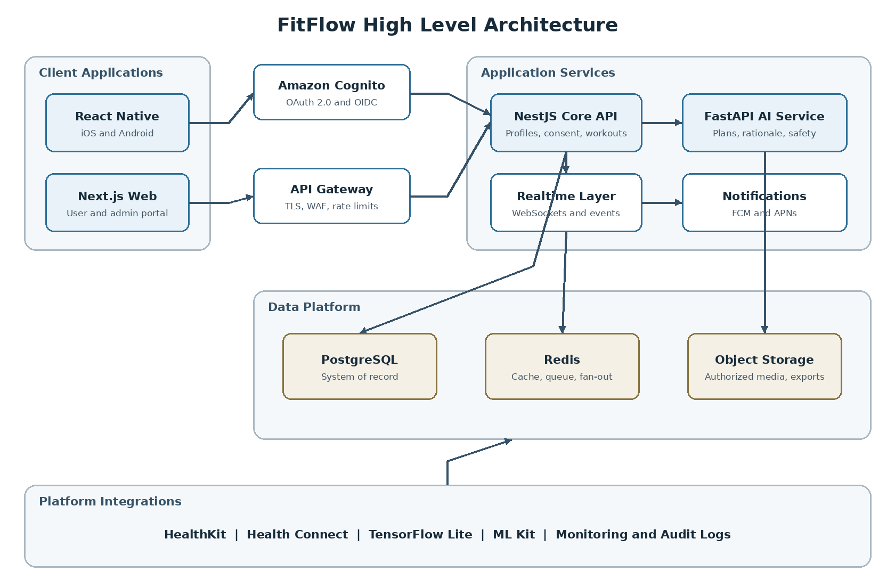
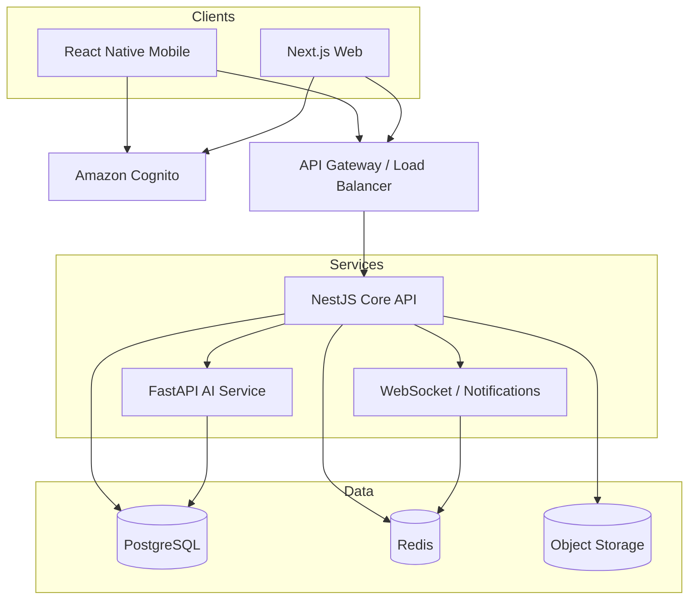
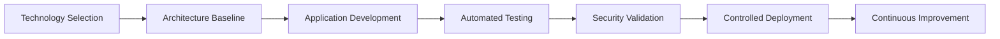

<div align="center">

# 🏋️ FitFlow Redesign

### Human-Centered Fitness • Intelligent Personalization • Privacy by Design


<br>

[](#)
[](#)
[](#)
[](#)

<br>

[](https://reactnative.dev/)
[](https://nextjs.org/)
[](https://nestjs.com/)
[](https://fastapi.tiangolo.com/)
[](https://www.postgresql.org/)
[](https://redis.io/)
[](https://aws.amazon.com/cognito/)

<br>

**Prepared for:** IT3060 – Human Computer Interaction<br>
**Programme:** BSc (Hons) in Information Technology<br>
**Year and Semester:** Year 3, Semester 2<br>
**Academic Year:** 2026

**Student:** W.M.R.C. Wijesinghe<br>
**Student ID:** IT23649644

<br>

> **FitFlow Redesign** is the technology-selection and high-level architecture baseline prepared for IT3060 Lab Exercise 05. It proposes a scalable, secure and maintainable implementation direction for a high-performance fitness experience across iOS, Android and the web.

</div>

---

## 📌 Table of Contents

- [Project Overview](#-project-overview)
- [Lab 05 Activities](#-lab-05-activities)
- [Project Goals](#-project-goals)
- [FitFlow Design Context](#-fitflow-design-context)
- [Selected Technology Stack](#-selected-technology-stack)
- [Why This Stack](#-why-this-stack)
- [Technology Decision Summary](#-technology-decision-summary)
- [High-Level Architecture](#️-high-level-architecture)
- [Core Data Flows](#-core-data-flows)
- [Security and Privacy](#-security-and-privacy)
- [Repository Structure](#-repository-structure)
- [Getting Started](#-getting-started)
- [CI/CD](#-cicd)
- [Branch Protection](#-branch-protection)
- [Documentation](#-documentation)
- [HCI Traceability](#-hci-traceability)
- [Architecture Decision Record](#-architecture-decision-record)
- [Scope and Limitations](#️-scope-and-limitations)
- [Future Development](#️-future-development)
- [Lab 05 Deliverables](#-lab-05-deliverables)
- [Author](#-author)

---

## 🌟 Project Overview

FitFlow is a cross-platform fitness application designed to support:

- Personalized workout planning
- Workout and activity tracking
- Low-effort nutrition logging
- Clear progress visualization
- Private social challenges
- Real-time updates and notifications
- Understandable AI recommendations
- User-controlled privacy and consent

The Lab 05 work evaluates frontend, backend, database and authentication technologies before recommending a complete implementation architecture. The recommendation is based on FitFlow-specific needs instead of technology popularity alone.

---

## 🧪 Lab 05 Activities

| Activity | Work Completed | Repository Evidence |
|---|---|---|
| **Activity 1** | Compared Flutter, React Native, Kotlin Multiplatform and Swift/SwiftUI | [`docs/technology-comparison.md`](docs/technology-comparison.md) |
| **Activity 2** | Compared backend, database and authentication options | [`docs/technology-comparison.md`](docs/technology-comparison.md) |
| **Activity 3** | Applied weighted criteria and selected the recommended stack | [`docs/decision-matrix.csv`](docs/decision-matrix.csv) |
| **Activity 4** | Designed the architecture, critical data flows and ADR | [`docs/architecture.md`](docs/architecture.md) and [`docs/adr/ADR-001-selected-technology-stack.md`](docs/adr/ADR-001-selected-technology-stack.md) |
| **Activity 5** | Prepared the GitHub-ready structure, documentation and CI workflow | This repository |

---

## 🎯 Project Goals

| Goal | Description |
|---|---|
| 📱 **Cross-platform delivery** | Provide seamless iOS, Android and web experiences |
| ⚡ **High performance** | Keep frequent workout, nutrition and progress interactions responsive |
| 🔄 **Code reuse** | Share TypeScript models, validation, API clients and design tokens |
| 🤖 **AI readiness** | Support personalized and explainable workout recommendations |
| 🔴 **Real-time features** | Enable challenge updates, notifications and synchronized progress |
| 🔐 **Privacy and security** | Protect identity, consent and personal fitness information |
| 📈 **Scalability** | Allow independent scaling of APIs, AI tasks and real-time workloads |
| 🛠️ **Maintainability** | Keep responsibilities clear for a mid-sized development team |
| 💰 **Cost control** | Begin with a practical architecture and scale only when required |
| ♿ **Accessibility** | Support accessible mobile and semantic web interaction patterns |

---

## 🧠 FitFlow Design Context

The selected technologies must support the following user-facing requirements:

- Fast and clear navigation
- Simple repeated workout and nutrition entries
- Personalized workout plans based on user goals and limitations
- Explanations for AI-generated recommendations
- Options to edit, regenerate, pause or reject a generated plan
- Clear portion sizes and measurement units
- Understandable weekly and monthly progress summaries
- Explicit audience selection for social sharing
- Private-by-default challenge participation
- Accessible interfaces across mobile and web

These requirements directly influenced the technology scoring, architecture boundaries and security controls.

---

## 🏆 Selected Technology Stack

| Layer | Selected Technology | Primary Role |
|---|---|---|
| 📱 **Mobile frontend** | **React Native + TypeScript** | Shared native iOS and Android application |
| 🌐 **Web frontend** | **Next.js + React + TypeScript** | Responsive and accessible web experience |
| 🔄 **Shared frontend packages** | **TypeScript** | Domain models, validation, API client and design tokens |
| 🧩 **Core backend** | **NestJS + Node.js** | REST API, business rules, authorization and WebSockets |
| 🤖 **AI microservice** | **FastAPI + Python** | Model inference, personalization and recommendation explanations |
| 🗄️ **Primary database** | **PostgreSQL** | Users, consent, workouts, nutrition, progress and social data |
| ⚡ **Cache and real-time layer** | **Redis** | Cache, queues, rate limits and event fan-out |
| 🔑 **Authentication** | **Amazon Cognito** | OAuth 2.0/OIDC identity, federation and MFA support |
| 🖼️ **Media storage** | **Private object storage** | User-authorized images, media and exports |
| 🔁 **Delivery** | **Docker + GitHub Actions** | Consistent builds, automated checks and deployment support |

---

## 💡 Why This Stack

### 📱 React Native for Mobile

React Native was selected for the iOS and Android applications because it provides:

- High mobile code reuse
- A productive React and TypeScript ecosystem
- Native-backed interface components
- Strong REST API and WebSocket support
- Access to native modules when required
- A practical path to HealthKit, Health Connect, notifications and camera features

Native integrations are kept behind adapters so platform-specific code remains isolated and maintainable.

### 🌐 Next.js for Web

A dedicated Next.js application avoids forcing every web screen through a mobile abstraction. It provides:

- Semantic HTML and strong accessibility support
- Responsive web-specific layouts
- Good performance and routing
- TypeScript sharing with mobile and backend code
- A mature React ecosystem

### 🧩 NestJS for the Core API

NestJS provides a structured TypeScript backend suitable for a mid-sized team. Its responsibilities include:

- Authentication-token validation
- User profiles and consent
- Workout plans and workout logs
- Nutrition records
- Progress summaries
- Private social challenges
- Authorization and audience rules
- AI-service orchestration
- WebSocket and notification coordination

### 🤖 FastAPI for AI Workloads

AI responsibilities are separated into a bounded Python service because Python provides a strong machine-learning and data-processing ecosystem.

The AI service can support:

- Personalized workout-plan generation
- Recommendation explanations
- Safe alternatives based on limitations
- Model inference and version tracking
- Future experimentation without coupling models to the core API

The NestJS API remains responsible for authentication, authorization, consent and durable storage.

### 🗄️ PostgreSQL as the System of Record

PostgreSQL is recommended for authoritative data because FitFlow contains strongly related and sensitive records, including:

- Users and profiles
- Consent decisions
- Workout plans and activity logs
- Nutrition records
- Progress measurements
- Challenge membership and visibility
- Audit references

Transactions, constraints, joins, indexing and JSON support provide a reliable base for operational queries and reporting.

### ⚡ Redis for Cache and Real-Time Coordination

Redis supports temporary and high-frequency operations such as:

- API caching
- Rate-limit counters
- Background job queues
- Real-time event distribution
- WebSocket fan-out
- Short-lived session information

Redis does not replace PostgreSQL as the authoritative data store.

### 🔐 Amazon Cognito for Authentication

Amazon Cognito was selected because it supports mobile and web identity using standard OAuth 2.0 and OpenID Connect flows while fitting the proposed AWS deployment boundary.

It can provide:

- User registration and sign-in
- Authorization Code flow with PKCE
- Token-based identity
- Social or enterprise federation
- Multi-factor authentication
- Account recovery controls

Authentication is not the same as authorization. NestJS must still enforce roles, record ownership, consent and social audience rules on every protected request.

---

## 📊 Technology Decision Summary

The complete stack alternatives were scored from **1 (weak)** to **5 (excellent)** using FitFlow-specific weighted criteria.

| Criterion | Weight |
|---|---:|
| Performance | 20% |
| Security and compliance readiness | 20% |
| Scalability | 15% |
| Development speed | 15% |
| Cost control | 10% |
| AI/ML support | 10% |
| Maintainability | 10% |
| **Total** | **100%** |

| Full-Stack Alternative | Weighted Score / 5 | Rank |
|---|---:|---:|
| **React Native + Next.js + NestJS + PostgreSQL + Cognito + FastAPI** | **4.55** | **1** |
| React Native + Firebase + Firestore + Firebase Auth | 4.20 | 2 |
| Kotlin Multiplatform + Go + DynamoDB + Cognito | 4.10 | 3 |
| Flutter + FastAPI + PostgreSQL + Auth0 | 4.00 | 4 |

> **Recommendation:** Use the TypeScript-centered hybrid stack with a separate Python AI service. It provides the strongest balance of performance, delivery speed, security, AI support and maintainability for FitFlow.

Detailed evidence is available in:

- [`docs/technology-comparison.md`](docs/technology-comparison.md)
- [`docs/decision-matrix.csv`](docs/decision-matrix.csv)
- [`docs/tech-stack-summary.md`](docs/tech-stack-summary.md)

---

## 🏗️ High-Level Architecture

<div align="center">



</div>



### Main Architectural Responsibilities

| Component | Responsibility |
|---|---|
| React Native | Native mobile interaction and device integrations |
| Next.js | Accessible web interaction and responsive layouts |
| Cognito | User identity and standards-based access tokens |
| API gateway/load balancer | Secure routing, traffic control and service distribution |
| NestJS | Business logic, validation, authorization and orchestration |
| FastAPI | AI/ML inference and recommendation explanations |
| PostgreSQL | Authoritative transactional records |
| Redis | Cache, queues, rate limits and real-time coordination |
| Object storage | Private media and export storage using short-lived access |

---

## 🔄 Core Data Flows

### 🏋️ 1. Personalized Workout Plan

```text
User → Mobile/Web → Cognito → NestJS → Consent Validation
     → FastAPI AI Service → Safety Rules and Explanation
     → NestJS → PostgreSQL → User Review
```

1. The user submits goals, availability, fitness level and relevant limitations.
2. NestJS authenticates the token and validates authorization, consent and inputs.
3. Only the minimum required data is sent to FastAPI.
4. FastAPI returns a plan, explanation, confidence information and safe alternatives.
5. NestJS stores an accepted plan and its provenance in PostgreSQL.
6. The user can edit, regenerate, pause or reject the recommendation.

### 👥 2. Private Social Challenge

```text
Mobile/Web → NestJS → Membership and Audience Check → PostgreSQL
           → Redis Event → Authorized WebSocket Recipients
```

Every read and write is checked against membership, ownership and visibility rules. Challenge participation must never provide automatic access to another user's private workout, nutrition or health-related information.

### 🥗 3. Nutrition Tracking

```text
Mobile/Web → NestJS → Input and Unit Validation → PostgreSQL
Optional Media → Signed Upload → Private Object Storage
Optional Assistance → On-device ML or FastAPI → User Confirmation
```

Food, portion, unit and time are stored as structured data. Images and automated suggestions remain optional and require user confirmation.

---

## 🔐 Security and Privacy

FitFlow may process personal activity, nutrition and fitness information. Security is therefore included throughout the architecture.

| Security Area | Implementation Direction |
|---|---|
| Authentication | OAuth 2.0/OIDC Authorization Code flow with PKCE |
| Authorization | Server-side role, ownership, consent and audience checks |
| Transport security | TLS for all external and internal communication |
| Stored data | Managed encryption at rest and controlled key access |
| Tokens | Short-lived access tokens and secure refresh-token handling |
| Consent | Explicit, recorded and revocable sharing decisions |
| Least privilege | Minimum permissions for users, services and administrators |
| Validation | Schema validation, safe error responses and parameterized queries |
| API protection | Rate limits, WAF rules and abuse monitoring |
| Media access | Private storage with short-lived signed URLs |
| Auditability | Administrative and sensitive-data access events |
| Log safety | Redaction of identity, health and authentication data |
| Data rights | Export, correction, retention and deletion workflows |
| Software supply chain | Dependency scanning, CI checks and protected branches |

> **Compliance note:** No framework, cloud service, database or identity provider makes FitFlow automatically HIPAA or GDPR compliant. Compliance depends on contracts, deployment configuration, lawful processing, data minimization, retention, access controls, incident response and continuous verification.

---

## 📁 Repository Structure

```text
fitflow-redesign/
├── .github/
│   ├── pull_request_template.md
│   └── workflows/
│       └── ci.yml
├── ai-service/
│   ├── app/
│   │   └── main.py
│   ├── README.md
│   └── requirements.txt
├── backend/
│   ├── src/
│   │   └── main.ts
│   ├── README.md
│   └── package.json
├── docs/
│   ├── adr/
│   │   └── ADR-001-selected-technology-stack.md
│   ├── architecture.md
│   ├── architecture.png
│   ├── architecture.svg
│   ├── decision-matrix.csv
│   ├── tech-stack-summary.md
│   └── technology-comparison.md
├── frontend/
│   ├── mobile/
│   │   └── README.md
│   └── web/
│       └── README.md
├── .editorconfig
├── .gitignore
├── CONTRIBUTING.md
├── package-lock.json
├── package.json
└── README.md
```

---

## 🚀 Getting Started

> This Lab 05 repository is an **architecture and starter scaffold**, not a completed production application. The included source files allow the initial structure and CI workflow to be verified.

### 1. Clone the Repository

```bash
git clone https://github.com/Rashini0926/fitflow-redesign.git
cd fitflow-redesign
```

### 2. Install Root and Backend Dependencies

```bash
npm install
```

### 3. Run the Repository Check

```bash
npm run check
```

### 4. Run the AI-Service Scaffold

Windows PowerShell:

```powershell
cd ai-service
python -m venv .venv
.\.venv\Scripts\Activate.ps1
pip install -r requirements.txt
uvicorn app.main:app --reload --port 8001
```

macOS or Linux:

```bash
cd ai-service
python3 -m venv .venv
source .venv/bin/activate
pip install -r requirements.txt
uvicorn app.main:app --reload --port 8001
```

### 5. Planned Frontend Applications

- `frontend/mobile/` will contain the React Native and TypeScript application.
- `frontend/web/` will contain the Next.js and TypeScript application.
- Shared contracts and design tokens can be introduced as workspace packages during implementation.

### Environment Safety

- Do not commit `.env` files or real credentials.
- Store production secrets in a managed secrets service.
- Provide only safe placeholder values through `.env.example` files when implementation begins.

---

## 🧪 CI/CD

GitHub Actions is configured in:

```text
.github/workflows/ci.yml
```

The current workflow:

- Checks out the repository
- Installs Node.js 22
- Installs project dependencies
- Validates the TypeScript backend scaffold
- Installs Python 3.12
- Compiles the Python AI-service source

<div align="center">

[](https://github.com/Rashini0926/fitflow-redesign/actions/workflows/ci.yml)

</div>

Future CI stages can add linting, unit tests, contract tests, accessibility tests, security scanning, container builds and controlled deployment.

---

## 🌿 Branch Protection

After the initial push, protect the `main` branch through **GitHub → Settings → Branches** or **Rulesets**.

Recommended settings:

- Require a pull request before merging
- Require at least one approval for team development
- Dismiss stale approvals after new changes
- Require the CI status check to pass
- Require conversation resolution
- Block force pushes
- Block branch deletion

---

## 📚 Documentation

<details>
<summary><b>Frontend, Backend, Database and Authentication Comparison</b></summary>

<br>

Compares:

- Flutter, React Native, Kotlin Multiplatform and Swift/SwiftUI
- NestJS, FastAPI, Go and Spring Boot
- PostgreSQL, MongoDB, Cloud Firestore and DynamoDB
- Amazon Cognito, Auth0, Firebase Authentication and Supabase Auth

➡️ [`docs/technology-comparison.md`](docs/technology-comparison.md)

</details>

<details>
<summary><b>Weighted Decision Matrix</b></summary>

<br>

Contains the weighted full-stack scoring based on performance, scalability, development speed, security, cost, AI/ML support and maintainability.

➡️ [`docs/decision-matrix.csv`](docs/decision-matrix.csv)

</details>

<details>
<summary><b>Technology Stack Summary</b></summary>

<br>

Explains the final hybrid recommendation and why it fits FitFlow.

➡️ [`docs/tech-stack-summary.md`](docs/tech-stack-summary.md)

</details>

<details>
<summary><b>High-Level Architecture</b></summary>

<br>

Documents components, critical data flows, security controls and scalability considerations.

➡️ [`docs/architecture.md`](docs/architecture.md)<br>
➡️ [`docs/architecture.png`](docs/architecture.png)<br>
➡️ [`docs/architecture.svg`](docs/architecture.svg)

</details>

<details>
<summary><b>Architecture Decision Record</b></summary>

<br>

Records the selected stack, alternatives, reasons, consequences and risk controls.

➡️ [`docs/adr/ADR-001-selected-technology-stack.md`](docs/adr/ADR-001-selected-technology-stack.md)

</details>

---

## 🧭 HCI Traceability

| FitFlow Need | Architectural Support |
|---|---|
| Personalized workouts | FastAPI inference with NestJS orchestration |
| Explainable recommendations | Explanation and provenance returned with AI results |
| User control over AI | Edit, regenerate, pause and reject workflows |
| Fast nutrition logging | Structured API flow with optional on-device assistance |
| Understandable progress | PostgreSQL history with mobile and web visual summaries |
| Private challenges | Consent and audience checks plus authorized real-time events |
| Cross-platform access | React Native mobile and Next.js web |
| Native health integrations | Isolated bridges for HealthKit and Health Connect |
| Low interaction latency | Caching, optimized APIs and Redis coordination |
| Accessibility | Native accessibility APIs and semantic web patterns |
| Maintainable growth | Modular NestJS core with a bounded AI service |

---

## 📝 Architecture Decision Record

**ADR-001 status:** Accepted for the FitFlow redesign prototype.

### Decision

Use React Native for mobile, Next.js for web, shared TypeScript packages, NestJS for the core API, FastAPI for AI workloads, PostgreSQL as the system of record, Redis for real-time coordination, Amazon Cognito for identity and private object storage for authorized media.

### Important Trade-offs

**Benefits:**

- Fast cross-platform mobile development
- Strong TypeScript sharing
- Dedicated semantic web experience
- Clear separation of product logic and AI inference
- Reliable relational data integrity
- Independent scaling of API, AI and real-time workloads

**Costs:**

- Two frontend renderers must be maintained
- Both TypeScript and Python toolchains are required
- Native-module and React Native upgrades require testing
- Cognito configuration needs careful governance
- Distributed services require monitoring and deployment discipline

Read the complete record: [`docs/adr/ADR-001-selected-technology-stack.md`](docs/adr/ADR-001-selected-technology-stack.md).

---

## ⚠️ Scope and Limitations

This repository represents the **Lab Exercise 05 technology-selection and high-level architecture stage**.

It includes:

- Technology comparisons
- Weighted decision making
- Recommended stack justification
- High-level architecture
- Critical feature data flows
- Security and scalability considerations
- Architecture Decision Record
- GitHub-ready repository structure
- Basic CI workflow

It is not:

- A finished mobile or web application
- A production deployment
- A clinically validated AI system
- Proof of HIPAA or GDPR compliance
- A fully trained production machine-learning model

Production use would require full implementation, usability validation, automated testing, security assessment, legal review, monitoring and operational controls.

---

## 🗺️ Future Development



Suggested implementation order:

1. Create shared API contracts and design tokens.
2. Implement Cognito sign-in and token validation.
3. Build the NestJS modular application core.
4. Create PostgreSQL schemas and consent rules.
5. Develop the React Native and Next.js user flows.
6. Integrate the bounded FastAPI AI service.
7. Add Redis caching, queues and WebSocket fan-out.
8. Add automated accessibility, security and end-to-end testing.
9. Deploy through controlled environments with monitoring and auditability.

---

## ✅ Lab 05 Deliverables

| Requirement | Status | Evidence |
|---|---|---|
| Frontend comparison | ✅ Included | Technology comparison document |
| Backend comparison | ✅ Included | Technology comparison document |
| Database comparison | ✅ Included | Technology comparison document |
| Authentication comparison | ✅ Included | Technology comparison document |
| Weighted decision matrix | ✅ Included | Decision matrix CSV |
| Recommended stack justification | ✅ Included | Stack summary and ADR |
| High-level architecture | ✅ Included | PNG, SVG and Markdown diagrams |
| Critical feature data flows | ✅ Included | Architecture documentation |
| Security and scalability notes | ✅ Included | Architecture and comparison documents |
| Architecture Decision Record | ✅ Included | ADR-001 |
| Repository structure | ✅ Included | Frontend, backend, AI service and docs folders |
| README | ✅ Included | This file |
| Basic CI workflow | ✅ Included | GitHub Actions workflow |

---

## 👩‍🎓 Author

<div align="center">

### W.M.R.C. Wijesinghe

**Student ID:** `IT23649644`<br>
**Module:** `IT3060 – Human Computer Interaction`<br>
**Programme:** `BSc (Hons) in Information Technology`<br>
**Year:** `Year 3 – Semester 2`<br>
**Academic Year:** `2026`

<br>

[](https://github.com/Rashini0926/fitflow-redesign)

<br>

### Designed with Human-Centered Computing in Mind

**Understand → Compare → Decide → Architect → Build → Evaluate**

</div>

---

<div align="center">

### ⭐ FitFlow Redesign

*Better fitness technology begins with understanding the people who use it.*

<br>


</div>
