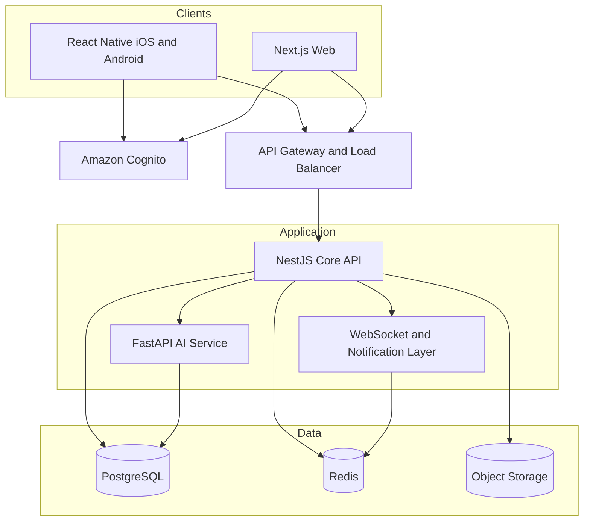

# FitFlow High Level Architecture

## System View

## Personalized Workout Plan Flow

1. The client obtains an access token through Cognito and submits goals, availability, fitness level, limitations, and consented data to the NestJS API.
2. NestJS authenticates the token, checks authorization and consent, validates inputs, and sends the minimum required features to FastAPI.
3. FastAPI applies model inference and safety rules, then returns a plan, explanation, confidence information, and alternatives.
4. NestJS stores the accepted plan and its provenance in PostgreSQL.
5. The client receives the plan and can explain, edit, pause, regenerate, or reject it.

## Private Social Challenge Flow

1. The client requests a challenge through the authenticated API.
2. NestJS checks membership and the selected visibility policy on every access.
3. PostgreSQL stores authoritative challenge and consent records.
4. An authorized event is published through Redis and delivered by the WebSocket or notification layer only to approved participants.
5. Private workout details remain excluded unless the user explicitly shares them.

## Nutrition Tracking Flow

1. The client sends food, portion, time, and optional image or barcode metadata.
2. NestJS validates units and stores structured nutrition data in PostgreSQL.
3. User-authorized images use short-lived signed uploads to object storage.
4. Optional on-device ML Kit or TensorFlow Lite assistance minimizes transfer of sensitive media.
5. Progress summaries are recalculated and returned to the client.

## Security and Scalability

- OAuth 2.0/OIDC Authorization Code with PKCE for public clients
- RBAC plus record-level ownership, consent, and audience checks
- TLS, encryption at rest, managed keys, secrets management, audit logs, and redacted operational logs
- Input validation, API rate limits, WAF controls, dependency scanning, and signed object URLs
- Stateless NestJS instances behind a load balancer; Redis for shared cache and realtime fan-out
- Asynchronous queues for notifications, media processing, and non-interactive AI jobs
- PostgreSQL backups, point-in-time recovery, read replicas, and tested restore procedures
- Data residency, retention, export, correction, and deletion policies defined before production

